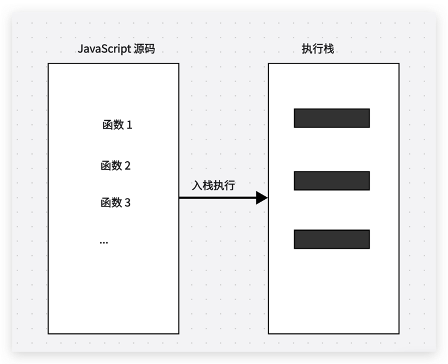
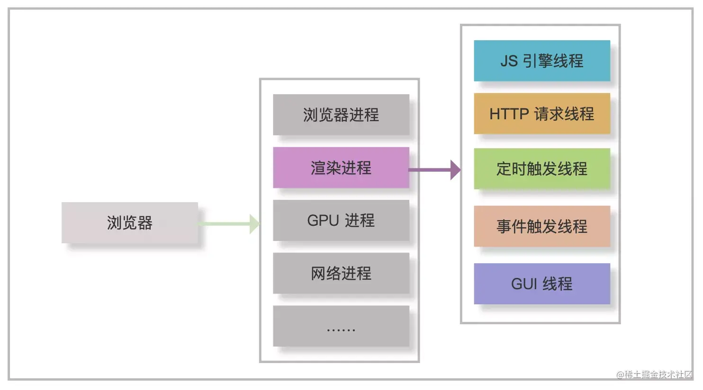

## 浏览器的事件循环（event loop）

### 简述

JavaScript 在解析代码的时候，会将同步代码按照执行顺序排列到执行栈。然后依照执行顺序执行执行栈里面的同步代码。如果遇到异步代码则交由其他的的线程处理，待当前的执行栈里面的同步代码执行完成后，将会从任务队列中取出已完成异步任务的回调加入到执行栈继续执行，如此循环往复。

另外执行栈执行 javascript 代码的方法时，将会创建当前的执行上下文环境，待这个方法执行完毕后则将其销毁，并从执行栈弹出。

### 任务队列

任务队列用于添加 JavaScript 异步代码的任务池。

任务队列分为微任务和宏任务两种。

javaScript 代码在执行(事件循环)的过程中，执行栈执行完同步代码后，会到任务队列中检查是否有微任务，如果有则优先执行微任务，如果没有则再去宏任务中检查是否有任务执行，如此反复循环。

微任务一般在当前循环中执行，宏任务则等待到下一次。

微任务队列只有一个，宏任务则可能存在多个。

#### 常见的微任务

Promise.then, Promise.catch,

new MutaionObserver()

process.nextTick()

#### 常见的宏任务

setTimeout()

setInterval()

setImmediate()

### 视图更新渲染

微任务队列执行完成后，也就是一次事件循环结束后，浏览器会执行视图渲染，当然这里会有浏览器的优化，可能会合并多次循环的结果做一次视图重绘，因此视图更新是在事件循环之后，所以并不是每一次操作 Dom 都一定会立马刷新视图。视图重绘之前会先执行 requestAnimationFrame 回调，那么对于 requestAnimationFrame 是微任务还是宏任务是有争议的，在这里看来，它应该既不属于微任务，也不属于宏任务。

### 浏览器进程

### 渲染进程

浏览器用来渲染 web 页面的进程。

#### JS引擎线程（主线程）： 
用于加载执行 js 脚本的线程，但是会与 GUI 渲染线程互斥，如果主线程代码执行时间过长，将会阻塞 GUI 渲染。

#### GUI渲染线程：

负责绘制页面，包括重绘和回流，主要解析 HTML，css 并构建 DOM 树，最终绘制到页面。

#### 事件触发线程：

负责将用户交互的行为事件加入到任务队列中等待执行。

#### Http线程：

主线程执行到 http 请求任务时，将会把该任务交由Http线程处理，等待Http线程处理完成后将回调假如到任务队列的尾部等待主线程执行。

#### 定时器触发线程：

负责处理JS 主线程中遇到的定时器任务，等到定时器时间结束后将回到假如到任务队列中，等待主线程执行。

[比较详细的讲解](https://juejin.cn/post/7164224261752619016?searchId=202406151058040659B4A68E22F0F9D9CA#heading-1)
[比较详细的讲解](https://juejin.cn/post/6978351327629803557)
