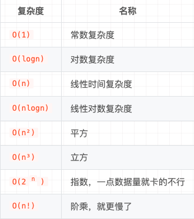

# 算法中的复杂度分析

一段代码的执行时需要一定的成本的，这个成本可以是时间上的消耗也可能是机器内存的消耗。

1. `数据结构`和算法解决是 “如何让计算机`更快时间`、`更省空间`的解决问题”。

2. 因此需从`执行时间`和`占用空间`两个维度来评估`数据结构`和算法的`性能`。

3. 分别用`时间复杂度`和`空间复杂度`两个概念来描述性能问题，二者统称为`复杂度`。

4. 复杂度描述的是`算法执行时`间（或`占用空间`）与`数据规模`的`增长`关系。

## 大 O 表示法

算法的`执行时间`与每行代码的`执行次数`成正比，用 `T(n) = O(f(n))` 表示。

其中 `T(n)` 表示算法执行总时间；

`f(n)` 表示每行代码`执行总次数`；

而 `n` 往往表示数据的规模。这就是大 `O` `时间复杂度表示法`。

# 时间复杂度

时间复杂度就是用来表示编写一段程序的执行需要耗时的一个量度。

例子1:

```tsx

function time() {
  console.log(1) // 执行1次
  
  console.log(2) // 执行1次
  
  console.log(3) // 执行1次
}

```
在上面的函数中只有三行代码，三个打印日志，所以这段代码的执行次数是 3。

套用公式：`T(n) = O(f(n))`， 已知执行总次数 = 3， f(3),所以 `T(n) = O(3)`。

由于 `时间复杂度` 描述的是算法`执行时间`与数据规模的`增长变化趋势`，所以 `常量`、`低阶`、`系数` 实际上对这种增长趋势不产生决定性影响，所以在做时间复杂度分析时 `忽略` 这些项。

在JS中表示规模增长的代码段一般是 `循环` 或者 `递归`。

**小知识点: 快速在分析复杂度的代码片段中找到`循环` 或者 `递归`**

所以： `O(3)` 一般简化成 `O(1)`，总次数 3`常量` 简化成 1。

时间复杂度：`O(1)`

例子2:

```tsx


function time(arr) {
  console.log('time') // 执行一次
  
  /**
   * 
   * arr 代表数据规模
   * 
   * arr.length 的长度变化代表增长规模的变化 n（简写表示）
   * 
   * */ 
  for (let i = 0; i < arr.length; i++) { // 需要执行 n + 1 次
    
    console.log(arr[i]) // n次
  }
}

time([0, 1, 2])

```

总执行次数 = `O(1 + (n + 1) + n) || O(2 + 2n)`, 其中表示`增长规模`是 `n`， 根据算法中只关注`数据规模`的`增长变化趋势`的原则，过滤掉 `常数` 和 `系数`

时间复杂度： `O(n)`。

例子3:

```tsx


function time(arr) {
  console.log('time') // 执行一次
  
  for (let i = 0; i < arr.length; i++) { // 需要执行 n + 1 次
    
    console.log(arr[i]) // n次
  }
  
  const data = {} // 执行一次
  
  arr.forEach(item => { // 需要执行 n + 1 次
    data[item] = item // n次
    
  })
}

time([0, 1, 2])

```
总执行次数 = `O(2 + 2n + 2 + 2n)` || `O(2n + 2n)` || `O(4n)`,忽略`系数4`所以上面的复杂度还是 `O(n)`。

例子4:

```tsx
function foo1(n){
    for( let i = 0; i < n; i++){ // 执行 n + 1
        for( let j = 0; j < n; j++){ // 执行 n + 1
            console.log("1111") // n
        }
    }
}

```
总执行次数 = **O(n + n<sup>2</sup>)**

在复杂度中，如果出现是`多项式`，取最高次项 **O(n<sup>2</sup>)**。


时间复杂度： **O(n<sup>2</sup>)**。

例子5:

```ts
let i=1;
while (i <= n)  {
    i = i * 2;
}

```

在循环体中，每次都将 `i` 扩大两倍，使之离 `n` 更加接近，用公式来表示就是2<sup>x</sup>=n，结果就是 `x=log2n`。再次忽略`常量`、`低阶`。

时间复杂度： `O(logn)`


例子6:

```ts
function a(n){ // 复杂度： O(logn)
    let i = 1;
    
    while (i <= n)  {
      i = i * 2;
    }
    
    return i
}
    
function foo(n) {
    let sum = 0;
    
    for (let i = 1; i <= n; ++i) { // 循环 复杂度 O(n)
      
      sum = sum + a(n);
    }
    return sum;
}

```

`O(n)` + `O(logn)` =  `O(nlogn)`

时间复杂度： `O(nlogn)`

### 复杂度表



# 空间复杂度
