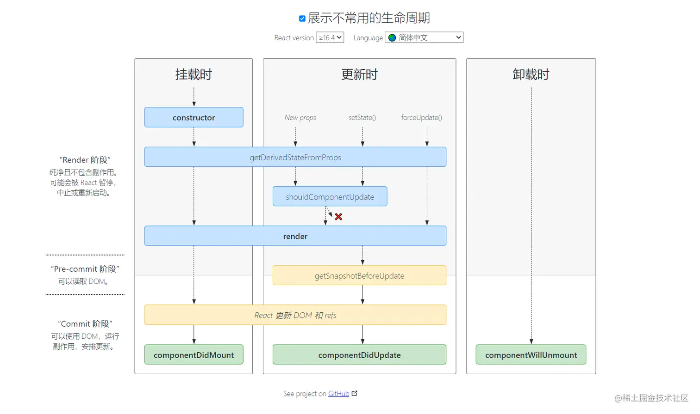

# `class` 时代下 component 生命周期




## 挂载阶段

### `挂载阶段` 1.`constructor`

挂载组件前，第一个执行的函数，组件生命周期阶段只执行一次。

执行`构造函数`，用于创建组件的状态`state`以及接收上层传递的属性`props`。


```tsx

class Com extends React.Component {
  
  // ... 
   
  constructor(props: any) {
    // 需要注意：如果你使用了 constructor 函数，你需要首先调用 super(props) 才能使用this关键字
    super(props);
    
    this.state = {
      // ...创建状态
    }
  }
  
  // ... 
   
  // render() { ...
 
}
```

### 挂载阶段 2.`static getDerivedStateFromProps`

从`props`派生`state`，挂载阶段执行一次，每次更新都在执行。

接收两个参数，一个是当前阶段的 `props` 另外一个是当前阶段的 `state`，用于修改组件的状态，如果无须修改返回 `null`。

```tsx


class Com extends React.Component {

  // ... 
   
  static getDerivedStateFromProps(props, state) {
    if (props.count > 0) {
      return {
        // ...
        name: props.name
      }
    }
    
    return null
  }

   // ... 

   // render() { ...
}
```

### 挂载阶段 3.`componentWillMount`

组件将要挂载阶段，组件生命周期阶段只执行一次。

注意⚠️： 该API 已在React v17.0开始删除。

在这一时期内设置的状态不会触发组件 `render` 的行为。因为这一时期是在 `render` 之前触发，不可能会做重新更新的操作。

```tsx


class Com extends React.Component {

  // ... 

  componentWillMount() {
    console.log('componentWillMount')
    
    // 在这里调用 setState 方法， 不会触发额外渲染
    // ...
  }

   // ... 

   // render() { ...
}
```


### `挂载阶段` 4.`render`

`挂载阶段`执行一次，每次重新渲染组件都会执行。

`render()` 方法是唯一必须的钩子函数，它在 `getDerivedStateFromProps` 阶段之后调用，用来更新屏幕视图的UI。

注意⚠️：不要在 `render()` 方法中改变 `state`，否则会陷入死循环，导致程序崩溃。

```tsx


class Com extends React.Component {
  
  constructor(props) {
    super(props);
    
    this.state = {
      name: 'render'
    }

  }

  render() {
    const { name } = this.state
    
    
    // 不要在这里修改 state 或调用 state
    return <div>{name}</div> // name: render
  }
}
```

如果添加`getDerivedStateFromProps`阶段,挂载阶段时期，`render` 调用之前当前的状态已被`getDerivedStateFromProps`阶段变更。

```tsx


class Com extends React.Component {
  
  constructor(props) {
    super(props);
    
    
    this.state = {
      name: 'render'
    }

  }
  
  static getDerivedStateFromProps(props, state) {
    if (props.count > 0) {
      return {
        ...state,
        name: props.name // 'www'
      }
    }
    
    return null
  }

  render() {
    const { name } = this.state
    
    
    // 不要在这里修改 state 或调用 state
    return <div>{name}</div> // name: www
  }
}
```

### 挂载阶段 5.`componentDidMount`

组件已挂载阶段，组件生命周期阶段只执行一次。

`render` 执行结束，组件被挂载后调用。这里可以用来操作副作用或者其他的诸如数据获取、DOM操作等等。


```tsx


class Com extends React.Component {
  
  constructor(props) {
    super(props);
    
    
    this.state = {
      name: 'render'
    }

  }
  
  componentDidMount() {
    // 操作诸如数据获取、DOM操作等等。
  }

  // render() { ...render
}
```

除了一些副作用的等等操作外， 也可以立即调用 `this.setState` 方法；但这将导致`重新渲染`，因为它启动了`更新阶段`，因为状态已经改变。

在使用 `componentDidMount`函数时，需要权衡下是否需要在该阶段内调用 `setState`操作状态，因为它可能导致不必要的`重新渲染`。


## 更新阶段

更新阶段, React class 组件的更新只有通过状态 `this.setState` 的变更才会触发 React 执行`更新阶段`, 包括 `props` 的变更， 原则上 `props`。

### `更新阶段` 1. `getDerivedStateFromProps`

`getDerivedStateFromProps` 函数将是更新阶段内第一个执行的函数，与挂载阶段相同。

但是尽量不要在这一阶段内执行副作用，可能会造成页面卡顿或者不流畅的bug，因为该函数每次都会在组件更新的阶段执行。


### `更新阶段` 2. `shouldComponentUpdate`

性能优化组件，源于React的设计理念，状态一旦变更时将会触发组件重新渲染。

接收两个参数，`nextProps`即将更新的`props`, `nextState`即将变更的`state`。

如果无须更新返回 `false`， 否则返回 `true`。

```tsx

class Child extends React.Component {
  constructor() {
    this.state = {
      count: 0,
      visible: true
    }
  }


  render() {
    const {count, visible} = this.state
    return (
      <>
        <Button onClick={() => {

          this.setState(state => {
            return {
              ...state,
              visible: !state.visible
            }
          })

        }}>操作count状态</Button>

        {visible && <p>显示 p 标签</p>}

        <Button onClick={() => {
          this.setState(state => {
            return {
              ...state,
              count: state.count + 1
            }
          })
        }}>操作count状态</Button>

        <Child count={count}/>
      </>
    )
  }
}

class Child extends React.Component {
  constructor(props) {
    super(props);
  }
  
  // 是否更新组件
  shouldComponentUpdate(nextProps, nextState, nextContext) {
    
    return true
  }

  render() {
    return (
      <div>
        {this.props.count}
      </div>
    )
  }
}
```
### 更新阶段 3. `render`

### 更新阶段 4. `componentWillMount`

### 更新阶段 5. `componentDidUpdate`

```tsx

class Prent extends React.Component<any, {count: number}> {
  
  constructor(props: any) {
    super(props);
    
    this.state = {
      count: 0
    }
  }
  
  
  static getSnapshotBeforeUpdate(prevProps: any, prevState: Readonly<{ count: number }>): any {
  }

  componentDidUpdate(prevProps: any, prevState: {count: number}, snapshot) {
    
    // ...
  }
  
}

```


## 卸载阶段

---

# `hooks` 时代下 component “生命周期”
